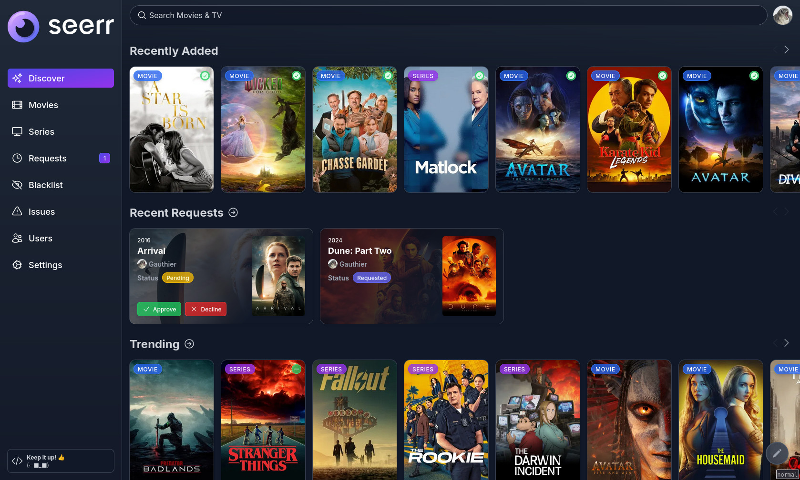

⚠️ <strong>NOTE:</strong> We are currently in the process of merging Overseerr and Jellyseerr into this unified repository.

<h1 align="center" style="font-size: 4em;">🚧 Seerr</h1>

**Seerr** is a free and open source software application for managing requests for your media library. It integrates with the media server of your choice: [Jellyfin](https://jellyfin.org), [Plex](https://plex.tv), and [Emby](https://emby.media/). In addition, it integrates with your existing services, such as **[Sonarr](https://sonarr.tv/)**, **[Radarr](https://radarr.video/)**.

## Current Features

- Full Jellyfin/Emby/Plex integration including authentication with user import & management.
- Support for **PostgreSQL** and **SQLite** databases.
- Supports Movies, Shows and Mixed Libraries.
- Ability to change email addresses for SMTP purposes.
- Easy integration with your existing services. Currently, Seerr supports Sonarr and Radarr. More to come!
- Jellyfin/Emby/Plex library scan, to keep track of the titles which are already available.
- Customizable request system, which allows users to request individual seasons or movies in a friendly, easy-to-use interface.
- Incredibly simple request management UI. Don't dig through the app to simply approve recent requests!
- Granular permission system.
- Support for various notification agents.
- Mobile-friendly design, for when you need to approve requests on the go!
- Support for watchlisting & blacklisting media.

With more features on the way! Check out our [issue tracker](/../../issues) to see the features which have already been requested.

## Getting Started

Check out our documentation for instructions on how to install and run Seerr:

https://docs.seerr.dev/getting-started/

## Preview

## Support

- Check out the [Seerr Documentation](https://docs.seerr.dev) before asking for help. Your question might already be in the docs!
- You can get support on [Discord](https://discord.gg/seerr).
- You can ask questions in the Help category of our [GitHub Discussions](/../../discussions).
- Bug reports and feature requests can be submitted via [GitHub Issues](/../../issues).

## API Documentation

You can access the API documentation from your local Seerr install at http://localhost:5055/api-docs

## Community

You can ask questions, share ideas, and more in [GitHub Discussions](/../../discussions).

If you would like to chat with other members of our growing community, [join the Seerr Discord server](https://discord.gg/seerr)!

Our [Code of Conduct](./CODE_OF_CONDUCT.md) applies to all Seerr community channels.

## Contributing

You can help improve Seerr too! Check out our [Contribution Guide](./CONTRIBUTING.md) to get started.

## Contributors ✨

