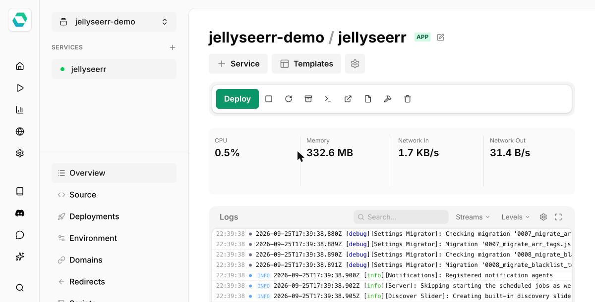

# Easypanel

:::warning
Third-party installation methods are maintained by the community. The Seerr team is not responsible for these packages.
:::

[Easypanel](https://easypanel.io) is a self-hosted Docker deployment platform. It maintains a one-click deployment template for Seerr (listed under Jellyseerr, its previous name):

[![Deploy on Easypanel][easypanel-btn]][easypanel-deploy]

The template deploys the official `seerr/seerr` image with a persistent volume mounted at `/app/config`.

[easypanel-btn]: https://easypanel.io/img/deploy-on-easypanel-40.svg
[easypanel-deploy]: https://easypanel.io/templates/jellyseerr
