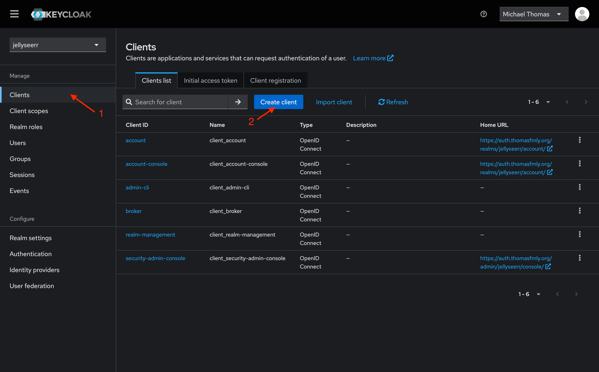
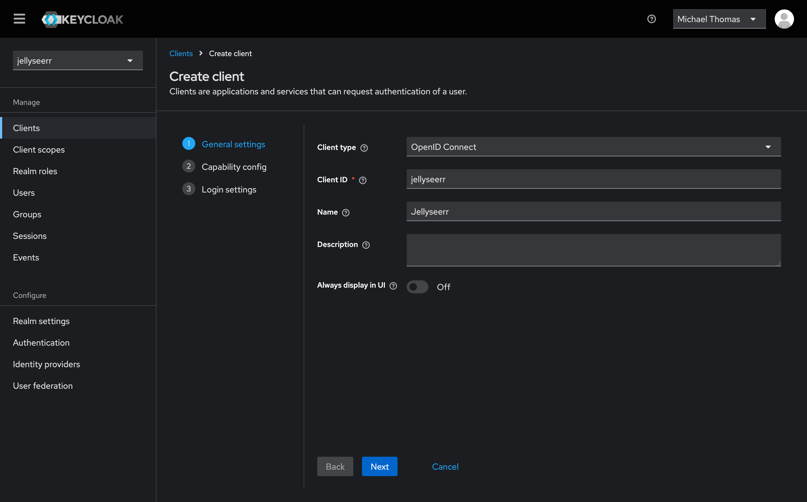
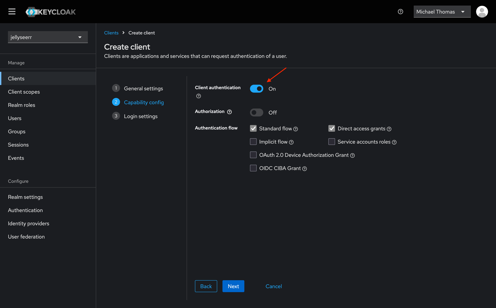
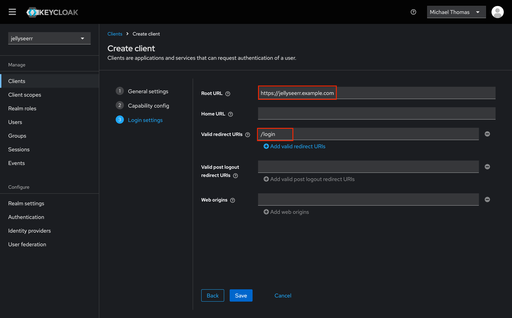
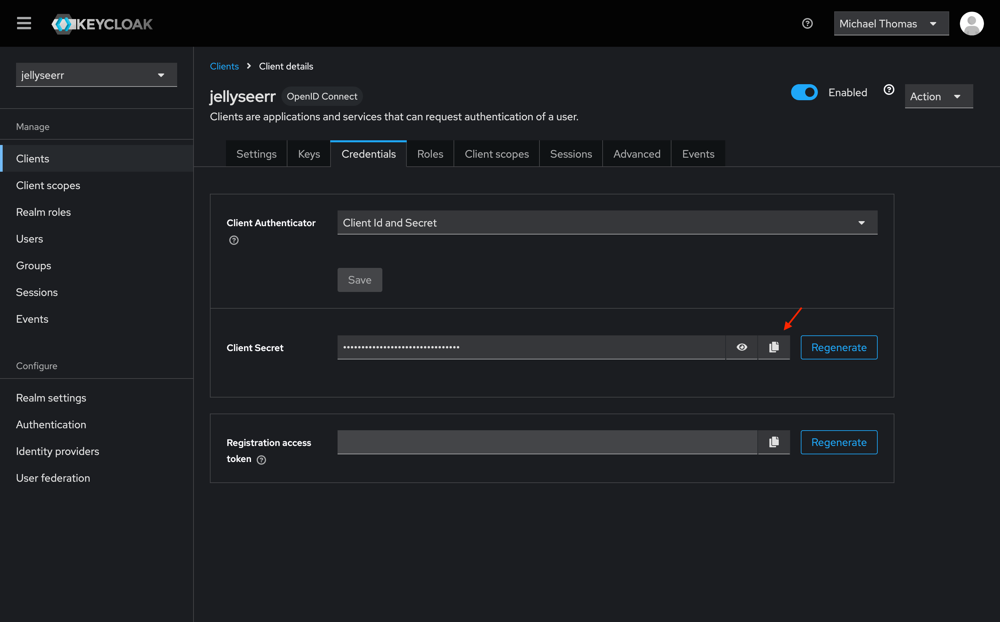

# OpenID Connect

Jellyseerr supports OpenID Connect (OIDC) for authentication and authorization. To begin setting up OpenID Connect, follow these steps:

1. First, enable OpenID Connect [on the User settings page](./index.md#enable-openid-connect-sign-in).
2. Once enabled, access OpenID Connect settings using the cog icon to the right.
3. Add a new provider by clicking the "Add Provider" button.
4. Configure the provider with the options described below.
5. Link your OpenID Connect account to your Jellyseerr account using the "Link Account" button on the Linked Accounts page in your user's settings.
6. Finally, you should be able to log in using your OpenID Connect account.

## Configuration Options

### Provider Name

Name of the provider which appears on the login screen.

Configuring this setting will automatically determine the [provider slug](#provider-slug), unless it is manually specified.

### Logo

The logo to display for the provider. Should be a URL or base64 encoded image.

:::tip

The search icon at the right of the logo field opens the [selfh.st/icons](https://selfh.st/icons) database. These icons include popular self-hosted OpenID Connect providers.

:::

### Issuer URL
The base URL of the identity provider's OpenID Connect endpoint

### Client ID

The Client ID assigned to Jellyseerr

### Client Secret

The Client Secret assigned to Jellyseerr

### Provider Slug

Unique identifier for the provider

### Scopes

Comma-separated list of scopes to request from the provider

### Required Claims

Comma-separated list of boolean claims that are required to log in

### Allow New Users

Create accounts for new users logging in with this provider

## Provider Guides

### Keycloak

To set up Keycloak, follow these steps:

1. First, create a new client in Keycloak.
  

1. Set the client ID to `jellyseerr`, and set the name to "Jellyseerr" (or whatever you prefer).
  

1. Next, be sure to enable "Client authentication" in the capabilities section. The remaining defaults should be fine. 
  

1. Finally, set the root url to your Jellyseerr instance's URL, and add the login page as a valid redirect URL.
  

1. With all that set up, you should be able to configure Jellyseerr to use Keycloak for authentication. Be sure to copy the client secret from the credentials page, as shown above. The issuer URL can be obtained from the "Realm Settings" page, by copying the link titled "OpenID Endpoint Configuration".
  
